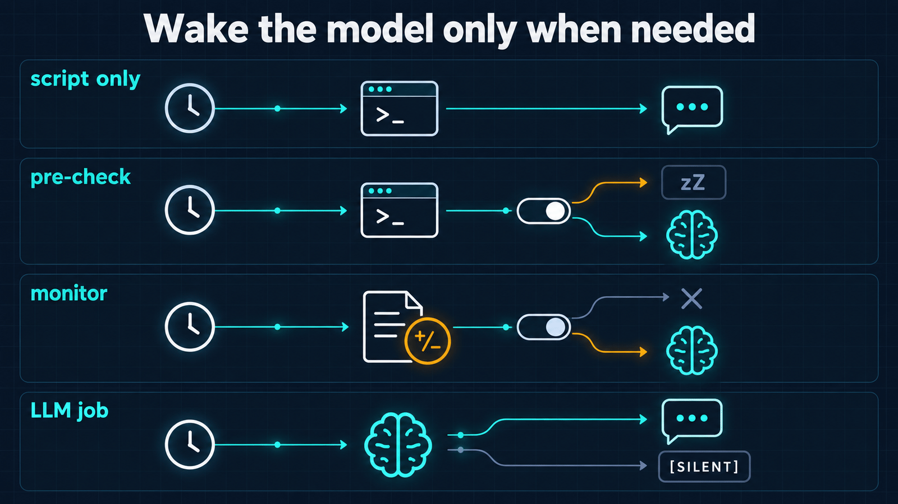
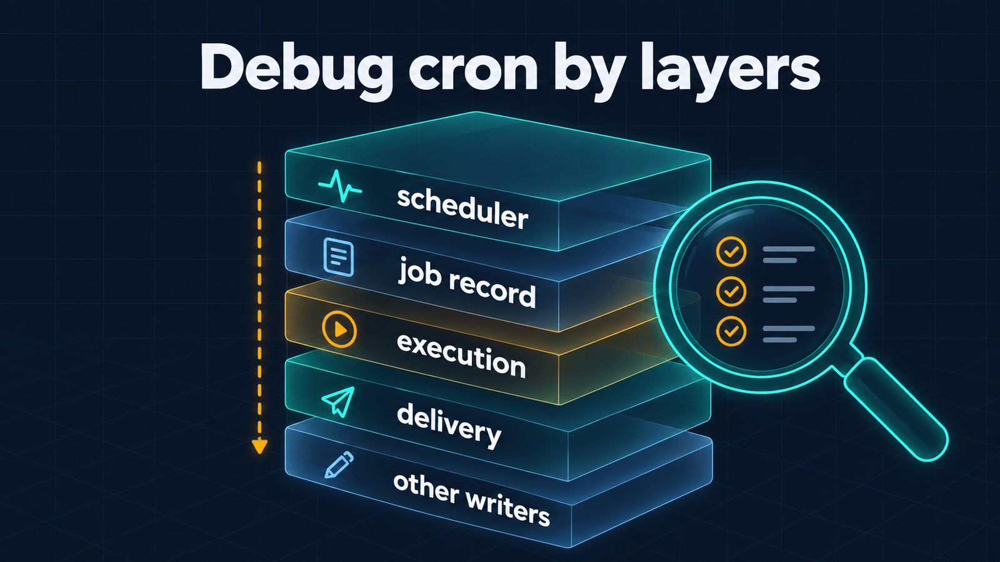

# hermes-cron


A skill that teaches [Hermes Agent](https://github.com/NousResearch/hermes-agent) to run its cron
scheduler like a careful operator: pick the right lifecycle action, keep jobs cheap and quiet, verify
every change and find the broken layer when a reminder does not arrive. It ships with a read-only
doctor script that complements the built-in `hermes cron doctor`.

## Why

Cron failures in an agent look like success. The tool answers `success: true`, the record says
`paused`, `last_status` is `ok` — and the messages keep coming, or never arrive. Typical causes:

- a bare `30m` was meant as "in 30 minutes" but schedules a job **every** 30 minutes;
- the prompt says "send a summary", so the agent sends it and the scheduler delivers it again;
- `deliver: origin` points at the chat where the job was created, not at the person it is for;
- a record with `enabled: true` and a pause marker never fires, yet the list shows it as scheduled;
- a pinned model ignores `hermes model` and skips the fallback chain when its provider is down.

The skill turns each of these into a rule the agent follows, and the doctor makes them visible.

## What you get

| Part | What it does |
| --- | --- |
| [`SKILL.md`](skills/hermes-cron/SKILL.md) | When to use, lifecycle table, cheap modes, procedure, pitfalls, verification |
| [`scripts/cron-doctor.py`](skills/hermes-cron/scripts/cron-doctor.py) | Read-only health check: scheduler, jobs, delivery, incidents |
| [`references/reference.md`](skills/hermes-cron/references/reference.md) | CLI, `cronjob` tool fields, schedules, statuses, markers, `cron:` settings |
| [`references/troubleshooting.md`](skills/hermes-cron/references/troubleshooting.md) | Symptom runbook: missed, late, duplicated, misrouted, silent jobs |

## Wake the model only when needed



| Situation | Mode | How it stays silent |
| --- | --- | --- |
| Text is known in advance; alert watchdog | `no_agent: true` + `script` | empty stdout or `{"wakeAgent": false}` |
| Fresh data needed, real work is rare | `script` pre-check | last line `{"wakeAgent": false}` |
| "Tell me when this changes" | `monitor` (script or URL) | unchanged output skips the agent run |
| The model decides, but not always reports | LLM job | reply exactly `[SILENT]` |

## Debug by layers



When a job misbehaves, the skill walks the layers top to bottom instead of rewriting the schedule:
is the scheduler ticking, is the record consistent, was there an attempt, was the result delivered,
and did a sync or deployment overwrite the change.

## Install

Pick one. Option 1 is the usual choice: the skill lands in `~/.hermes/skills/` and the agent picks it
up from its description.

**1. As a regular skill (recommended)**

```bash
hermes skills install itpartypattaya/hermes-cron/skills/hermes-cron
```

**2. As a portable plugin** (Agent Plugins v1 package: `plugin.json` + `skills/`)

```bash
hermes plugins install itpartypattaya/hermes-cron --no-enable
hermes plugins enable hermes-cron
```

Plugin skills are read-only and namespaced. They are not listed in the system prompt; the agent finds
them through `skills_list` and loads them with `skill_view`.

**3. Manually**

```bash
git clone https://github.com/itpartypattaya/hermes-cron.git
cp -r hermes-cron/skills/hermes-cron ~/.hermes/skills/
```

## Use it

Ask the agent in plain words; the skill covers the rest.

- "Remind me in 30 minutes to call the bank." → a one-shot `in 30m`, verified, with the exact time.
- "Pause the morning digest until Monday." → `pause`, the return date stated, no new duplicate job.
- "Ping me only if the disk is over 90 %." → a script-only watchdog, tested for silence and for alert.
- "Why didn't the 9 am report arrive?" → doctor first, then the layer that broke, then the fix.

## The doctor

```bash
python3 ~/.hermes/skills/hermes-cron/scripts/cron-doctor.py              # all jobs
python3 ~/.hermes/skills/hermes-cron/scripts/cron-doctor.py --job <id>   # one job + recent runs
python3 ~/.hermes/skills/hermes-cron/scripts/cron-doctor.py --json       # for automation
python3 ~/.hermes/skills/hermes-cron/scripts/cron-doctor.py --no-builtin # skip `hermes cron doctor`
```

Inside the skill the path is `${HERMES_SKILL_DIR}/scripts/cron-doctor.py`, so it works wherever the skill
is installed. The doctor runs the built-in `hermes cron doctor` when the CLI is found (`PATH`,
`~/.local/bin` or `HERMES_BIN`) and adds what it does not check:

- ticker heartbeat and last successful tick, with the PID that wrote the stamp;
- disabled, paused and half-paused jobs — the built-in check looks at active jobs only;
- duplicate ids, unknown schedule kinds, `no_agent` without a script, failure streaks;
- the latest `delivery_outcome` of every job and open failure incidents from `executions.db`;
- pinned models and thread-less delivery into chats that use threads.

Without the CLI it performs the basic checks itself. Exit codes: `0` healthy, `1` findings,
`2` unreadable runtime state, `3` invalid arguments or an unknown job.

```text
== Scheduler ==
  heartbeat: 12 s ago, PID 41873
  successful tick: 12 s ago

== Built-in hermes cron doctor ==
  ✓ Cron doctor found no issues
    Checked 6 active job(s).

== Findings ==
  🔴 3f2a9c1d7e44 "Weekly report": enabled=true with a pause marker — Hermes will not run it,
     yet `cron list` shows it as scheduled; pause or resume it properly

== Notes ==
  ℹ️ 8b1e6d0a2f93 "Nightly digest": pinned model (model-x · provider-y) — does not follow
     `hermes model` and does not use the global fallback chain
```

## Safety and privacy

- Read-only. The doctor never ticks, runs, edits or removes a job.
- No network access and no API keys. The only subprocess is the local `hermes cron doctor`, started
  as an argument list without a shell. Hermes' own job loader, like every scheduler tick, may repair
  malformed entries in `jobs.json`.
- It reads `~/.hermes/cron/jobs.json`, the ticker stamps and `executions.db` (opened read-only). It
  writes nothing.
- The skill registers no tools, hooks or middleware and needs no environment variables.

## Compatibility

Written and tested against Hermes Agent 0.21.5:

- `in 30m` is one-shot; `30m` and `every 30m` repeat; `every monday 9am` and `weekdays at 9am` become
  cron expressions;
- jobs follow the main model at fire time unless pinned;
- a job runs only when `enabled` is true and it carries no pause marker;
- the ticker heartbeat is `<epoch> <pid>` (older `<epoch>` stamps are still read).

On an older Hermes, check flags with `hermes cron create --help` before following the examples.

## Scope

The skill covers the standard Hermes cron contract and assumes no repository, user, chat, timezone or
delivery target. GitOps snapshots, three-way merges, persistent configuration and organization-specific
alert routing are out of scope; keep them in a separate local skill loaded alongside this one.

## Repository layout

```text
plugin.json                      # Agent Plugins v1 manifest
skills/hermes-cron/
  SKILL.md
  scripts/cron-doctor.py
  references/reference.md
  references/troubleshooting.md
tests/test_cron_doctor.py        # stdlib unittest, no network
docs/                            # images used by this README
```

## Development

```bash
python3 -m unittest discover -s tests -v
```

Issues and pull requests are welcome.

## Author

Anton Vaskov — Telegram [@passone](https://t.me/passone), GitHub [itpartypattaya](https://github.com/itpartypattaya).

## License

[MIT](LICENSE)
